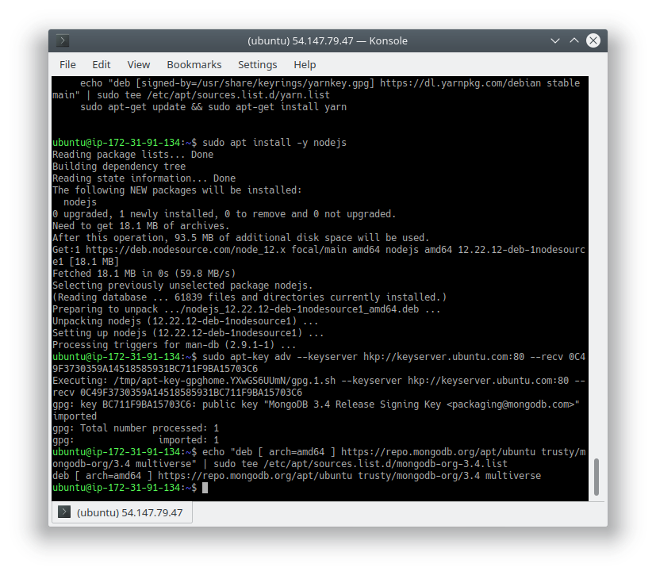

### PROJECT4 Banjo Babade  (darey.io) Devops Trainng
#### Implementation of  MEAN STACK DEPLOYMENT TO UBUNTU IN AWS
1. AWS instance ubuntu 20.04 was used

2. tried to perform ssh-copy-id -i /home/ubuntu/.ssh/id_rsa.pub  ubuntu@MY-IP-ADDRESS **failed severally**
   

3. sudo apt update
4. sudo apt upgrade
   
 

 

[^1]: sudo apt -y install curl dirmngr apt-transport-https      lsb-release ca-certificates

[^1]: curl -sL https://deb.nodesource.com/setup_12.x | sudo -E bash -

5. **Install MongoDB** sudo apt install -y mongodb
6. **Start The MongoDB server** sudo service mongodb start
7. **Check the status of the server** sudo systemctl status mongodb
8. **Node package manager installation** sudo apt install -y npm
9. **body parser installation** sudo npm install body-parser
   
    

    
10. sudo apt-key adv --keyserver hkp://keyserver.ubuntu.com:80 --recv 0C49F3730359A14518585931BC711F9BA15703C6

11. echo "deb [ arch=amd64 ] https://repo.mongodb.org/apt/ubuntu trusty/mongodb-org/3.4 multiverse" | sudo tee /etc/apt/sources.list.d/mongodb-org-3.4.list
    
    

    

